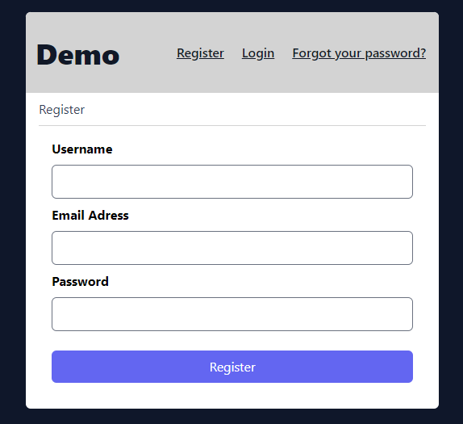
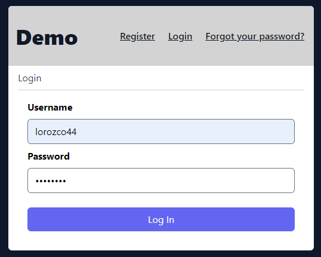
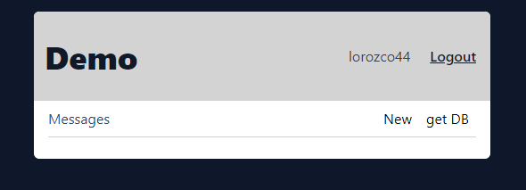

# 🚀 Proyecto Ciclo 3 - Sprint 3 

## Indicaciones para ejecutar el proyecto.

### 1. Clonar el Repositorio:

Lo primero que debemos hacer es hacer una copia local del repositorio:

```
https://github.com/mundevux/Ciclo3_Desarrollo_De_Software-_2
```

### 2. Ejecutar el entorno virtual:

Una vez tengamos clonado el repositorio, debemos ejecutar el entorno virtual de la base de datos, y para esto debemos abrir la terminal en modo **administrador** en el directorio donde guardamos el repositorio y ejecutar el siguiente comando:

```
venv\Scripts\activate
```
Para estar seguros que estamos dentro del entorno virtual, debemos fijarnos que justo antes del directorio hay una sigla así **(venv)**.

### 4. Ejecutar el programa:

Dentro del entorno virtual ejecutaremos los siguientes comandos:

```
flask init-db
```
```
flask run
```

Al ejecutar **flask run** la consola nos indicara el puerto de ejecucion del proyecto, por lo general es el:

```
http://127.0.0.1:5000/
```

Abriendo ese enlace desde nuestro navegador, podremos ver el programa en ejecucion.


## Dentro del Proyecto:

Si ejecutamos todos los pasos anteriores correctamente podemos ver el siguiente pantallazo de registro:



Debemos llenar los 3 campos, **Username**, **Email**, **Password**, y una vez llenados los campos correctamente, debemos dar click en **Register**, a continuación volvemos a la consola donde nos genero un link para activar el usuario que acabamos de registrar:


Donde daremos click, para poder activar el usuario e ingresar con las credenciales:



